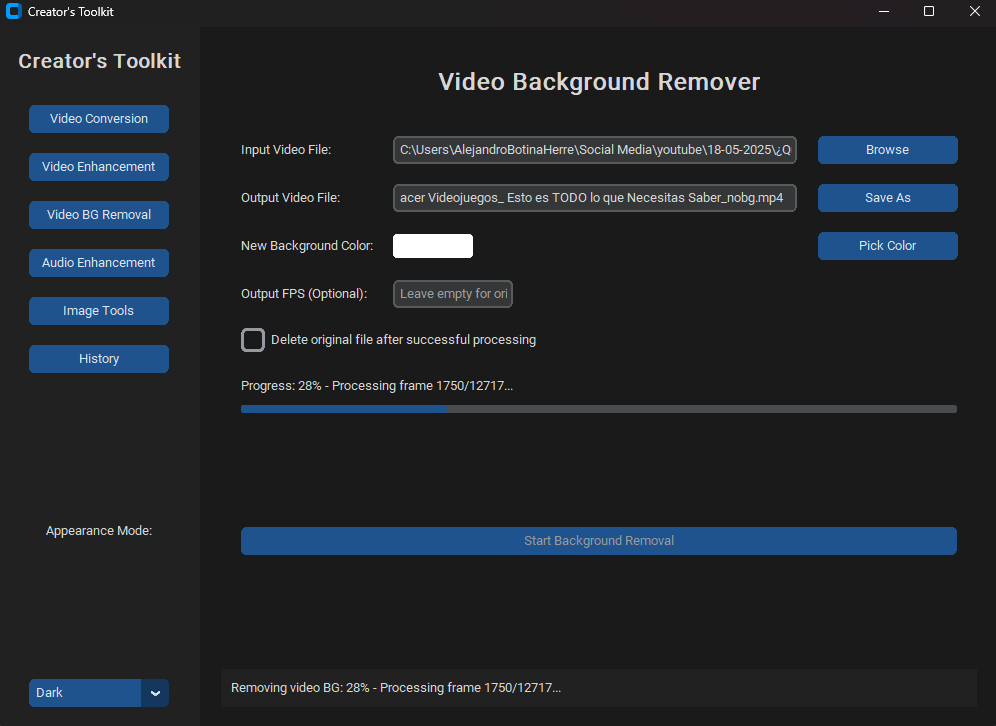

# Creator's Toolkit for Windows 11

## Professional Media Processing & Automation Suite

 ---

## 🚀 Project Overview

The "Creator's Toolkit" is a desktop application designed for content creators, offering a unified graphical interface (GUI) for automating common media processing tasks. Built with Python 3.11 and leveraging powerful libraries like FFmpeg, MoviePy, OpenCV, and Rembg, this application aims to provide a streamlined, efficient, and high-quality solution for video conversions, audio enhancements, background removal, and more, specifically optimized for Windows 11.

This project evolved from a collection of command-line scripts previously used on Fedora, now being re-engineered to deliver a native, clean, and intuitive user experience on Windows. Our primary focus is on performance efficiency, especially on systems with less powerful CPUs but ample RAM, ensuring smooth operation and superior output quality.

## ✨ Key Features (Planned)

* **Video Conversion:** Seamlessly convert `.mpg` videos to optimized `.mp4` format.
* **Professional Video Processing:** Advanced video styling, including subtitles, optimized face tracking, and quality enhancements.
* **Audio Cleaning & Enhancement:** Professional-grade noise reduction and vocal clarity improvements for audio files.
* **Image Background Removal:** Quickly remove backgrounds from images with enhanced quality output.
* **Video Background Removal:** Transform video clips by removing or replacing their backgrounds.
* **Stylized Video Enhancements:** Apply various visual improvements like denoising, sharpening, contrast, saturation, and more to videos.
* **Intuitive User Interface:** A clean, modern, Canva-like UI built with CustomTkinter for a native Windows 11 feel.
* **Operation History:** Keep track of all processed tasks, including inputs, outputs, and status.
* **User-Defined Paths:** Full control over input and output file selection and naming.
* **Efficient Resource Management:** Optimized for performance on systems with varying hardware capabilities, focusing on multiprocessing and RAM efficiency.
* **Comprehensive Logging & Error Handling:** Robust system for logging operations and gracefully handling errors.

## 💻 System Requirements

* **Operating System:** Windows 11 (64-bit)
* **Python:** Version 3.11
* **FFmpeg:** A recent, full-featured FFmpeg build installed and accessible via system's PATH. (Your current version `N-120010-ge6298e0759-20250623` is perfect).
* **Recommended RAM:** 8GB or more (40GB as in the developer's machine is excellent for demanding video tasks).
* **Disk Space:** Sufficient space for input/output media files and application installation.

## 🛠️ Installation (Planned)

### From Source (For Developers)

1.  **Clone the repository:**
    ```bash
    git clone https://github.com/CodeWithBotina/creators-toolkit.git
    cd creators-toolkit
    ```
2.  **Create and activate a virtual environment (recommended):**
    ```bash
    python -m venv venv
    .\venv\Scripts\activate
    ```
3.  **Install dependencies:**
    ```bash
    pip install -r requirements.txt
    ```
4.  **Ensure FFmpeg is installed:**
    Download the latest FFmpeg build from [https://ffmpeg.org/download.html](https://ffmpeg.org/download.html) and add its `bin` directory to your system's PATH environment variable.
5.  **Run the application:**
    ```bash
    python src/main.py # (or whatever the main entry point will be)
    ```

### Via Installer (For Users - Future)

A standalone installer for Windows 11 will be provided, allowing easy installation without requiring Python or FFmpeg to be pre-installed by the end-user (FFmpeg will be bundled). This installer will aim for distribution via methods like Winget or a direct download.

## 📜 Usage (Planned)

_Detailed instructions on how to use the GUI will be provided here once the application is developed._

## 📂 Project Structure (Planned)

````

creators-toolkit/
├── src/
│   ├── core/                  \# Core application logic, threading, logging
│   ├── gui/                   \# CustomTkinter UI components, layouts
│   ├── modules/               \# Encapsulated logic for each processing type (video, audio, image)
│   │   ├── video_converter.py
│   │   ├── video_enhancer.py
│   │   ├── audio_processor.py
│   │   ├── image_bg_remover.py
│   │   └── video_bg_remover.py
│   ├── utils/                 \# Helper functions (file dialogs, path handling)
│   └── main.py                \# Main application entry point
├── assets/                    \# UI icons, images, styling
├── logs/                      \# Application logs
├── config/                    \# Configuration files
├── docs/                      \# Documentation, design notes
├── tests/                     \# Unit and integration tests
├── requirements.txt           \# Python dependencies
├── README.md                  \# Project overview and instructions
├── LICENSE                    \# Project license (MIT)
└── .gitignore                 \# Files to ignore in Git

```

## 🤝 Contributing

Contributions are welcome! Please refer to `CONTRIBUTING.md` (to be created) for guidelines on how to contribute.

## 🐞 Bug Reports & Feature Requests

Please report any bugs or suggest new features via the GitHub Issues page.

## 📄 License

This project is licensed under the MIT License - see the [LICENSE](LICENSE) file for details.

## udos

Special thanks to the developers of Python, CustomTkinter, FFmpeg, MoviePy, OpenCV, Rembg, and all other open-source libraries that make this project possible.
